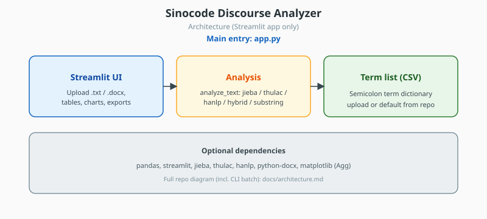
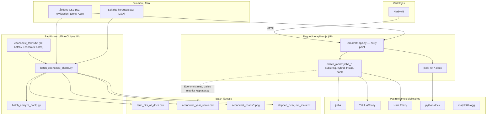
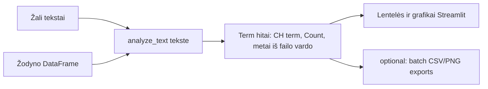
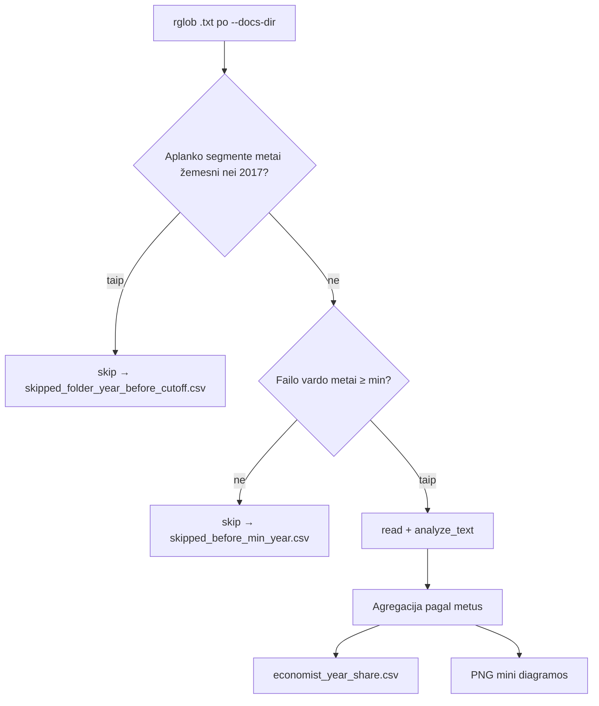

# Sinocode Discourse Analyzer — architektūra

**Pagrindinė aplikacija:** Streamlit **`app.py`** (tai, ką paleidžiate naršyklėje).  
**Papildomai (be UI):** `batch_analyze_hanlp.py` ir `batch_economist_charts.py` — tas pats `analyze_text` principas, bet masiniam korpusui ir Economist PNG/CSV išvestims.

**SVG schema** (`docs/architecture.svg`, kopija repo šaknyje `architecture.svg`): tik **Streamlit `app.py`** kelias — **be** offline batch. Visa repo su batch — žemiau Mermaid diagramose.

## 1. Aukšto lygio komponentai

**THULAC:** segmentatorius naudojamas **Streamlit** (`app.py`), kai pasirenkamas `thulac` režimas (lazy `thulac.thulac`). CLI `batch_analyze_hanlp.py` / `batch_economist_charts.py` šiuo metu `--match-mode` **neturi** `thulac` — ten galimi `jieba_precise`, `jieba_search`, `substring`, `hybrid`, `hanlp`.

## 2. Duomenų srautas (analizė)

## 3. Batch Economist (2017+)

## 4. Statinis paveikslėlis (SVG, be batch)

- [`docs/architecture.svg`](architecture.svg) ir [`architecture.svg`](../architecture.svg) — **tik** pagrindinė aplikacija (`app.py`).
- Trečias blokas vadinasi **Term list (CSV)** (ne „Lexicon“): tai aiškiau nei angl. *lexicon* („žodynas“, sąrašas leksikų). Seniau diagramoje buvo bendrinis angliškas žodis be konteksto.
- SVG **nemini** Economist pavadinimo (batch / atskiros ataskaitos lieka Mermaid skyriuose).
- Pilnas vaizdas su CLI batch: **1 skyrius** (Mermaid) ir šis `.md` failas.

## 5. Kaip peržiūrėti Mermaid

- GitHub / GitLab: šis `.md` failas dažnai automatiškai piešia diagramas.
- [mermaid.live](https://mermaid.live): įklijuokite `flowchart` bloką.
